# layout_pdf2md 소스코드 분석 및 설계 문서

## 개요
`layout_pdf2md`는 PDF 페이지를 텍스트 span 단위로 분해하고, 레이아웃/폰트 정보를 활용해 마크다운으로 재조합한 뒤 형태소 분석과 TF-IDF 키워드 라벨링을 수행하여 `.md` 파일로 저장한다. CLI 엔트리포인트는 `python -m layout_pdf2md <input.pdf>`이며 내부적으로 `pdf2md` 파이프라인을 실행한다.

## 플로우차트
```mermaid
flowchart TD
    A[CLI: python -m layout_pdf2md <pdf>] --> B[__main__.py: parse args]
    B --> C[pdf2md(file_path)]
    C --> D[get_pdf_ast_from]
    D --> E[analyze_doc_meta / analyze_doc_style]
    E --> F[iter_page_pipeline(generator)]
    F -->|per page & rail| G[preprocess: classify -> filter -> markdown]
    G --> H[accumulate md text]
    H --> I[split by <SEP> section]
    I --> J[analize_morphemes per section]
    J --> K[normalize_synonym_tokens]
    K --> L[iter_tf_idf_keywords: add META & KEYWORDS]
    L --> M[write <name>.md]
```

## 시퀀스 다이어그램

```mermaid
sequenceDiagram
    participant CLI as CLI (__main__)
    participant Core as core.pdf2md
    participant Parser as fitz.Document
    participant Analyzer as services analyzers
    participant Writer as Markdown Writer

    CLI->>Core: pdf2md(input_path)
    Core->>Parser: get_pdf_ast_from(path)
    Parser-->>Core: page_count, document
    Core->>Analyzer: analyze_doc_meta(doc)
    Core->>Analyzer: analyze_doc_style(doc)
    loop pages
        Core->>Analyzer: iter_page_pipeline(doc, meta, styles)
        Analyzer-->>Core: page_idx, md_chunk (per rail/preprocess)
        Core->>Core: append md_chunk
    end
    Core->>Analyzer: analize_morphemes(section)
    Core->>Analyzer: normalize_synonym_tokens(morphemes)
    Core->>Analyzer: iter_tf_idf_keywords(morphemes)
    Analyzer-->>Core: keywords + page marks
    Core->>Writer: sections with META/KEYWORDS
    Writer-->>CLI: <input name>.md 파일 생성
```


## 코드 리뷰 메모
- **파이프라인 구조**: `pdf2md`는 PDF AST 취득 → 문서 메타/스타일 분석 → 페이지 단위 제너레이터 → 형태소/TF-IDF 후처리를 일관된 순서로 실행해 책임이 명확하다.【F:src/layout_pdf2md/core.py†L40-L121】
- **페이지 처리**: `iter_page_pipeline`에서 페이지를 수평 절개(y-rail)하며 `preprocess`로 마크다운을 생성하는 방식은 기사/논문 등 다단 레이아웃을 안정적으로 처리할 수 있게 설계되어 있다.【F:src/layout_pdf2md/core.py†L132-L199】
- **형태소 및 키워드 라벨링**: 섹션 단위로 형태소 분석 후 동의어 정규화와 TF-IDF 키워드 삽입을 수행해 결과 마크다운에 메타데이터를 추가하는 로직이 포함되어 있다.【F:src/layout_pdf2md/core.py†L68-L117】
- **개선 제안**:
  - 예외 처리: 파일 열기/파싱, 쓰기 단계에서 예외 처리가 없어 실패 시 원인 파악이 어렵다. `fitz.open`, 파일 쓰기, 형태소 분석 단계에 대한 try/except 및 사용자 친화적 메시지/정리 루틴 추가가 필요하다.【F:src/layout_pdf2md/core.py†L40-L121】
  - 리소스 정리: `iter_page_pipeline`에서 `table_object`의 해제나 큰 리스트의 명시적 정리가 없어 대용량 PDF 처리 시 메모리 사용이 커질 수 있다. 제너레이터 종료 후 참조 해제나 페이지 단위 cleanup을 고려하면 좋다.【F:src/layout_pdf2md/core.py†L143-L199】
  - 로깅 정보: 형태소 분석 루프에서 `page_idx` 사용은 내부 반복문 외부 변수로, 섹션별 로그가 실제 페이지와 불일치할 수 있다. 섹션 인덱스 기반 로그로 변경하면 디버깅 가독성이 향상된다.【F:src/layout_pdf2md/core.py†L76-L83】
```
